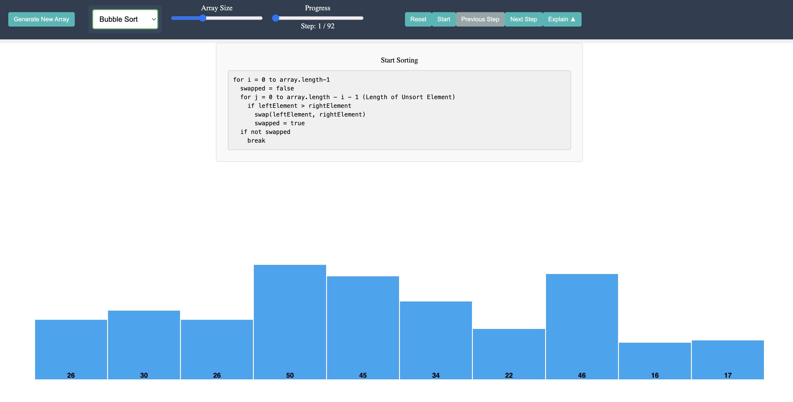

## Try It Out

### 🚀 [Try the Sorting Visualizer now!](https://tonylai1101.github.io/Sorting-Visualizer/)

## Features

### Visualize Multiple Sorting Algorithms:

- Bubble Sort
- Selection Sort
- More algorithms coming soon!

### Interactive Controls:

- Adjust array size to see how algorithms perform with different data sets
- Step through the sorting process for a detailed understanding
- Use Previous and Next step buttons to step through the sorting process for a detailed understanding

### Educational Tools:

- View the algorithm's code alongside the visualization
- Highlighting of code lines corresponding to the current step
- Real-time display of variable states for deeper comprehension
